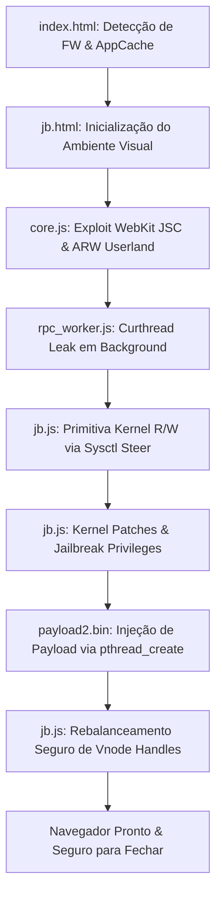

# RAW13G — PS4 13.02–13.52 WebKit & Kernel Host (Edição de Alta Estabilidade)

Host offline otimizado, independente e focado em estabilidade de hardware e software para consoles **PlayStation 4** nos firmwares **13.02, 13.04, 13.50 e 13.52**.

Este projeto incorpora melhorias de engenharia do kernel FreeBSD e padrões arquiteturais importados do ecossistema de exploits do PS5 (PSFree, UMTX e IPv6 UAF), eliminando falhas históricas de **Luz Branca da Morte (WLOD / Desligamento Infinito)**, **Kernel Panics por concorrência** e **erros de memória no WebKit (`CE-34878-0`)**.

---

## 📋 Sumário

- [Visão Geral e Filosofia](#visão-geral-e-filosofia)
- [Arquitetura da Cadeia de Execução](#arquitetura-da-cadeia-de-execução)
- [Engenharia de Estabilidade & Mitigações Implementadas](#engenharia-de-estabilidade--mitigações-implementadas)
  - [1. Eliminação da Luz Branca da Morte (WLOD / Desligamento Infinito)](#1-eliminação-da-luz-branca-da-morte-wlod--desligamento-infinito)
  - [2. Prevenção de Kernel Panics & Watchdog Timeouts](#2-prevenção-de-kernel-panics--watchdog-timeouts)
  - [3. Higiene de Memória do WebKit & Watchdog de Heap](#3-higiene-de-memória-do-webkit--watchdog-de-heap)
  - [4. Validação Prévia de Offsets & Alinhamento de Memória](#4-validação-prévia-de-offsets--alinhamento-de-memória)
  - [5. Blindagem Contra Reexecução Acidental & Autonomia do Payload](#5-blindagem-contra-reexecução-acidental--autonomia-do-payload)
- [Estrutura do Repositório](#estrutura-do-repositório)
- [Instruções de Uso](#instruções-de-uso)
- [Aviso Legal](#aviso-legal)

---

## Visão Geral e Filosofia

- **Foco em Estabilidade**: Prioridade absoluta para a integridade do hardware, evitando locks do sistema de arquivos VFS e travamentos no ciclo de energia.
- **Payload Nativo Suportado**: Mantém `payload2.bin` (PS4HEN com suporte verificado até a versão 13.52), sem dependências de forks instáveis de GoldHEN.
- **Ambiente Limpo e Seguro**: Sem anúncios externos, pop-ups, scripts de terceiros ou redirecionamentos de monetização.
- **Operação 100% Offline**: Manifesto `cache.appcache` rigorosamente sincronizado via SHA-256 para carregamento instantâneo diretamente pelo Guia do Usuário (`User's Guide`).

---

## Arquitetura da Cadeia de Execução



1. **Estágio WebKit (Userland)**:
   - Disparo de corrupção de tipos / Use-After-Free no JavaScriptCore via [core.js](file:///c:/Users/Thiago%20Silva%20Costa/raw13g.github.io/core.js).
   - Obtenção de leitura e escrita arbitrária em espaço de usuário (ARW) e armamento do JIT Pivot nativo via `Math.expm1` modificado.
2. **Estágio de Thread Leak**:
   - Criação e coordenação de Web Workers ([rpc_worker.js](file:///c:/Users/Thiago%20Silva%20Costa/raw13g.github.io/rpc_worker.js)) para vazamento do endereço de thread do kernel (`curthread`) e estrutura de credenciais (`td_ucred`).
3. **Estágio de Kernel Read/Write**:
   - Modificação das estruturas MIB do FreeBSD `kern.maxfilesperproc` e `kern.maxfiles`, permitindo leitura e escrita arbitrária de 64 bits na memória do kernel a velocidade nativa de syscall.
4. **Estágio de Jailbreak & Lançamento de Payload**:
   - Aplicação de patches no kernel (`DO_PATCH`).
   - Escalonamento de privilégios (`cr_uid = 0`, `cr_sceCaps = -1`).
   - Criação da thread do payload (`payload2.bin`) via `pthread_create`.
   - Rebalanceamento imediato dos contadores de referência do kernel FreeBSD.

---

## Engenharia de Estabilidade & Mitigações Implementadas

### 1. Eliminação da Luz Branca da Morte (WLOD / Desligamento Infinito)

#### Causa do Problema no PS4

No FreeBSD/Orbis OS, ao fugir da sandbox, os campos `fd_rdir` e `fd_jdir` (na `struct filedesc` do processo) são apontados para o nó raiz global do sistema de arquivos (`rootvnode`), e `cr_prison` para `prison0`. Como o exploit não realiza os incrementos legítimos de referência (`vref()` e `prison_hold()`), quando o navegador fecha ou o console é desligado, a rotina `exit1()` chama `fdescfree()`, que executa `vrele()` no `rootvnode`.

Isso provoca um **underflow na contagem de referência do sistema de arquivos raiz**. Ao desligar o console (`sys_reboot`), a chamada `vfs_unmountall()` trava aguardando o lock do vnode corrompido em um `msleep` infinito. A ventoinha continua girando e o console **permanece pulsando a luz branca indefinidamente**.

Além disso, o evento clássico `pagehide` **não dispara no PS4** quando o usuário aperta o botão PS para sair ou desliga o console diretamente.

#### Soluções Implementadas em jb.js

- **Desacoplamento de Credenciais vs. Handles VFS**: A rotina `jbRestoreHook` foi reestruturada para restaurar imediatamente os ponteiros perigosos `fd_rdir`, `fd_jdir` e `cr_prison`, prevenindo o underflow no `fdescfree()`, enquanto mantém o processo com `cr_uid = 0` e `cr_sceCaps = -1` para que o payload (`payload2.bin`) permaneça com permissões de root.
- **Ciclo de Vida de Eventos Completo**: Adicionados listeners para `visibilitychange` (`document.visibilityState === "hidden"`), `beforeunload`, `pagehide` e `unload`. No PS4, quando o usuário toca no botão PS, o evento **`visibilitychange` dispara imediatamente**, garantindo que as estruturas estejam balanceadas antes de qualquer encerramento do processo.
- **Janela de Acomodação (Settle Window)**: Implementada uma pausa de 600ms após o `pthread_create` para permitir que as threads residentes do payload inicializem seus hooks no kernel antes do balanceamento dos handles.

---

### 2. Prevenção de Kernel Panics & Watchdog Timeouts

#### Problemas Identificados

- **Loop Infinito do Worker**: O arquivo [rpc_worker.js](file:///c:/Users/Thiago%20Silva%20Costa/raw13g.github.io/rpc_worker.js) continha uma função `spin()` com um `for(;;)` ininterruptível consumindo 100% de CPU. No encerramento do processo, o WebKit tentava parar as threads (`WorkerThread::stop` / `pthread_join`), mas a thread em loop cego não respondia, provocando o disparo do Watchdog Timer do kernel.
- **Colisão Concorrente com `multiFire`**: Após o payload iniciar, a ausência de um `return` fazia o código cair em uma segunda rodada de corrupção assíncrona (`multiFire(mf3)`), colidindo com a inicialização do payload e provocando Kernel Panic.
- **Vazamento de Sockets com Cabeçalho IPv6**: Falhas no fechamento de sockets em lote no bloco `finally` deixavam descritores de rota IPv6 pendentes na tabela do kernel.

#### Soluções Implementadas

- **Worker Cooperativo e Máquina de Estados Anti-KP ([rpc_worker.js](file:///c:/Users/Thiago%20Silva%20Costa/raw13g.github.io/rpc_worker.js) e [jb.js](file:///c:/Users/Thiago%20Silva%20Costa/raw13g.github.io/jb.js))**:
  - O loop infinito foi substituído por um loop cooperativo em fatias com `setTimeout(loop, 0)` e flag `spinning`, controlado por `stopSpin()`.
  - Implementada uma **Máquina de Estados de Workers** (`CREATED` -> `ARMED` -> `KERNEL_ACTIVE` -> `PARKED` -> `TAINTED`) com o método de proteção `safeTerminate()`. Quando uma thread tem suas estruturas de kernel (`td_proc`, `td_ucred`) manipuladas, qualquer chamada de `worker.terminate()` é bloqueada preventivamente (`WORKER-TERMINATE-GUARD`), evitando que o WebKit desmonte a thread via `pthread_cancel`/syscalls corrompidas que causariam Kernel Panic instantâneo.
- **Supressão de Execução Fantasma**: Neutralização imediata dos sockets em `POOL` e encerramento limpo via `return;` após `allDone = true`, eliminando o fallthrough redundante para `multiFire`.
- **Ledger Idempotente de Recursos (`ResourceLedger`)**:
  - Substituição de arrays primitivos de descritores pela classe `ResourceLedger`, que registra a origem e o tipo de cada descritor (`ipv6-probe`, `socketpair`, `ipv6-pool`, `kern-file-probe`).
  - Prevenção ativa de *double-close* e isolamento de falhas individuais no `finally`, garantindo que tabelas de descritores de rede e sockets IPv6 sejam liberadas sem corromper a tabela `filedesc` do sistema.

---

### 3. Higiene de Memória do WebKit & Watchdog de Heap

- **Limpeza Ativa entre Tentativas ([core.js](file:///c:/Users/Thiago%20Silva%20Costa/raw13g.github.io/core.js))**: Implementada a rotina `releaseAttemptAllocations()` para limpar referências a arrays de spray e introduzido um intervalo mínimo de 750ms entre tentativas para que a coleta de lixo (GC) do JavaScriptCore atue, prevenindo erros `CE-34878-0` (Out-of-Memory). O garbage collection é tratado rigorosamente como otimização de heap de userland, nunca como mecanismo de segurança ou restauração de ring-0.
- **Watchdog de Recuperação de Heap ([jb.html](file:///c:/Users/Thiago%20Silva%20Costa/raw13g.github.io/jb.html))**: Quando o WebKit atinge o teto de tentativas (`attempt-ceiling`), o watchdog reinicia a página automaticamente (limite de 2 reloads a cada 10 minutos via `sessionStorage`), renovando o espaço de endereçamento sem exigir intervenção manual do usuário. Essa estratégia de *hard reload* é executada estritamente antes de qualquer escrita no kernel.

---

### 4. Validação Prévia de Offsets & Alinhamento de Memória

- **Checagem Pré-Vôo Estrutural ([ps4_offsets.js](file:///c:/Users/Thiago%20Silva%20Costa/raw13g.github.io/ps4_offsets.js))**: A função `validateOffsets()` inspeciona a presença de todas as chaves obrigatórias (`REQUIRED_KEYS` e `NEED_K`) e valida o **alinhamento obrigatório de 8 bytes** para ponteiros e símbolos de kernel (`k_prison0`, `k_rootvnode`, `k_sysent`, `k_oid_*`). Se qualquer desalinhamento ou chave ausente for detectada, a execução é abortada no primeiro instante (`stage=pre_primitive`), impedindo dereferências nulas ou instrução ilegal no hardware.

---

### 5. Blindagem Contra Reexecução Acidental & Autonomia do Payload

- **Lock de Execução de Dupla Camada ([jb.js](file:///c:/Users/Thiago%20Silva%20Costa/raw13g.github.io/jb.js) e [jb.html](file:///c:/Users/Thiago%20Silva%20Costa/raw13g.github.io/jb.html))**:
  - Sentinela em memória (`__RAW13G_JB_EXECUTION_OWNER__`) contra importações ou chamadas redundantes dentro do mesmo documento.
  - Bloqueio persistente em `localStorage` (`raw13g:jb:execution-lock:v2`) com verificação atômica de posse (*readback*), impedindo concorrência entre abas ou reentradas antes do reinício do console.
  - Heartbeat periódico (15s) e expiração defensiva contra locks órfãos (TTL de 180s) caso uma aba trave no estado `running`.
  - Botão interativo de liberação rápida (`#executionReset` / `?reset-lock=1`) acessível diretamente na interface do [jb.html](file:///c:/Users/Thiago%20Silva%20Costa/raw13g.github.io/jb.html) e integrado ao [index.html](file:///c:/Users/Thiago%20Silva%20Costa/raw13g.github.io/index.html) para recomeçar sem atrito após o reinício físico do PS4.
- Em [jb.js](file:///c:/Users/Thiago%20Silva%20Costa/raw13g.github.io/jb.js), foi inserida uma checagem preventiva no início da cadeia do kernel (`uid === 0 || setuid(0) === 0`). Se o console já estiver desbloqueado, a execução é abortada imediatamente com a mensagem `"ALREADY JAILBROKEN"`, evitando concorrência destrutiva na tabela de processos do kernel.
- O payload nativo (`payload2.bin`) é inicializado como thread desacoplada via `pthread_create` com uma janela de acomodação de 600ms, tornando-o completamente autônomo e independente do ciclo de vida ou recarregamento da interface web.

---

## Estrutura do Repositório

| Arquivo | Descrição |
| :--- | :--- |
| [index.html](file:///c:/Users/Thiago%20Silva%20Costa/raw13g.github.io/index.html) | Tela de boas-vindas, identificação rigorosa do firmware (parser de User-Agent em base hexadecimal), sincronização de AppCache e redirecionamento de diagnóstico (`?log=1`). |
| [jb.html](file:///c:/Users/Thiago%20Silva%20Costa/raw13g.github.io/jb.html) | Shell visual com feedback em tempo real e watchdog de reciclagem de heap. |
| [jb.js](file:///c:/Users/Thiago%20Silva%20Costa/raw13g.github.io/jb.js) | Núcleo do exploit: JIT pivot, primitive R/W de kernel, patches, anti-reexecução, gerenciador de ciclo de vida (`visibilitychange`) e balanceamento de handles. |
| [core.js](file:///c:/Users/Thiago%20Silva%20Costa/raw13g.github.io/core.js) | Exploit de userland para o WebKit, gerenciamento de tentativas e higiene de memória GC. |
| [rpc_worker.js](file:///c:/Users/Thiago%20Silva%20Costa/raw13g.github.io/rpc_worker.js) | Worker cooperativo para vazamento do ponteiro `curthread` sem loops bloqueantes de CPU. |
| [mem.js](file:///c:/Users/Thiago%20Silva%20Costa/raw13g.github.io/mem.js) & [int64.js](file:///c:/Users/Thiago%20Silva%20Costa/raw13g.github.io/int64.js) | Camada de abstração de memória de baixo nível e operações aritméticas de 64 bits. |
| [ps4_offsets.js](file:///c:/Users/Thiago%20Silva%20Costa/raw13g.github.io/ps4_offsets.js) | Tabelas calibradas de símbolos e estruturas do kernel FreeBSD para 13.02, 13.04, 13.50 e 13.52. |
| [cache.appcache](file:///c:/Users/Thiago%20Silva%20Costa/raw13g.github.io/cache.appcache) | Manifesto offline com verificação criptográfica SHA-256 de todos os componentes. |
| [payload2.bin](file:///c:/Users/Thiago%20Silva%20Costa/raw13g.github.io/payload2.bin) | Carga útil nativa (HEN) suportada nativamente nas versões alvo. |

---

## Instruções de Uso

### 1. Hospedagem Local ou Remota

- O repositório pode ser servido via GitHub Pages ou localmente usando qualquer servidor web estático compatível com MIME types padrão:

  ```powershell
  # Exemplo com Python local
  python -m http.server 8080
  ```

### 2. Primeiro Acesso no PS4 (Cacheamento Offline)

1. Conecte o PS4 à mesma rede do host.
2. Abra o Navegador de Internet ou acesse o **Guia do Usuário** (`Configurações > Guia do Usuário`).
3. Digite o endereço do host.
4. Aguarde a mensagem informando que os arquivos foram cacheados offline (`cached for offline use`).
5. A partir desse momento, a conexão com a internet pode ser desligada.

### 3. Execução

- O processo é automatizado. O log detalhado é exibido na tela (`?log=1`).
- Ao finalizar, a mensagem indicará que o payload está em execução e o navegador pode ser fechado com segurança pelo botão PS, sem risco de congelamento do console ou luz branca piscando no desligamento.

---

## Aviso Legal

Este projeto foi desenvolvido exclusivamente para fins de **pesquisa em segurança da informação, engenharia reversa e desenvolvimento de software homebrew**. Os desenvolvedores não se responsabilizam pelo uso indevido das ferramentas ou por quaisquer danos decorrentes de modificações não autorizadas em hardware.
