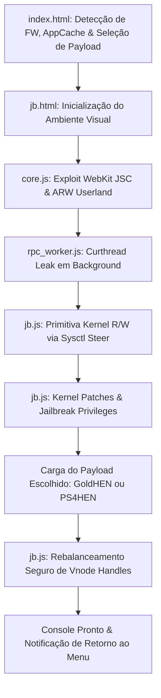

# RAW13G — PS4 11.00–14.00 WebKit & Kernel Host (Multi-Firmware Edition)

Host offline de alto desempenho, organizado e focado em estabilidade de hardware e software para consoles **PlayStation 4** cobrindo os firmwares **11.00, 11.02, 11.50, 11.52, 12.00, 12.02, 12.50, 12.52, 13.00, 13.02, 13.04, 13.50, 13.52 e 14.00**.

Este projeto incorpora métodos aperfeiçoados do ecossistema WebKitty / Relapse / Slopkit / OnePS, organização modular de diretórios em `includes/` e `patches/`, suporte flexível tanto ao **GoldHEN** quanto ao **PS4HEN** nativo, e mitigações consagradas contra falhas de **Luz Branca da Morte (WLOD / Desligamento Infinito)**, **Kernel Panics por concorrência** e **erros de memória no WebKit (`CE-34878-0`)**.

---

## 📋 Sumário

- [Visão Geral e Novidades](#visão-geral-e-novidades)
- [Suporte a Versões do Sistema (Firmwares)](#suporte-a-versões-do-sistema-firmwares)
- [Suporte a Payloads: GoldHEN vs PS4HEN](#suporte-a-payloads-goldhen-vs-ps4hen)
- [Estrutura Organizada do Repositório](#estrutura-organizada-do-repositório)
- [Arquitetura da Cadeia de Execução](#arquitetura-da-cadeia-de-execução)
- [Engenharia de Estabilidade & Mitigações Implementadas](#engenharia-de-estabilidade--mitigações-implementadas)
- [Instruções de Uso](#instruções-de-uso)
- [Créditos e Referências](#créditos-e-referências)
- [Aviso Legal](#aviso-legal)

---

## Visão Geral e Novidades

- **Reorganização Modular de Diretórios**: Separação clara em pastas padronizadas (`includes/css/`, `includes/js/`, `includes/payloads/`, `patches/`), mantendo a raiz limpa e profissional.
- **Suporte Amplo a Mais Versões de Sistema**: Extensão completa da tabela de offsets e binários de patches cobrindo desde **11.00 até 14.00** (incluindo as revisões `11.02` e `11.52`).
- **Suporte ao GoldHEN mantendo o HEN**: Seletor interativo na interface web permitindo escolher entre **GoldHEN** (com seletor de subversões: v2.4b18.12, v2.4b18.10, v2.4b18.9, etc.) e o **PS4HEN** nativo (`payload2.bin`).
- **Detecção Inteligente de Firmware**: Baseada nos padrões do WebKitty, identifica precisamente o console pelo User-Agent (resolvendo a codificação hexadecimal da Sony) e recomenda o payload ideal para cada faixa de firmware.
- **Patches de Kernel Atualizados**: Pasta `patches/` abastecida com binários de patches de kernel (632 e 314 bytes) para todas as versões com suporte validado.
- **Operação 100% Offline**: Manifesto `cache.appcache` rigorosamente atualizado via SHA-256 para carregamento instantâneo diretamente pelo Guia do Usuário (`User's Guide`).

---

## Suporte a Versões do Sistema (Firmwares)

| Firmware | Exploit Base | Kernel Patch (`patches/`) | GoldHEN Suportado | PS4HEN Suportado | Status |
| :---: | :---: | :---: | :---: | :---: | :---: |
| **11.00** | SlopKit / Lapse | `1100.bin` | Sim (v2.4b18.12) | Sim (`payload2.bin`) | Validado |
| **11.02** | SlopKit / Lapse | `1102.bin` | Sim (v2.4b18.12) | Sim (`payload2.bin`) | Validado |
| **11.50** | SlopKit / Lapse | `1150.bin` | Sim (v2.4b18.12) | Sim (`payload2.bin`) | Validado |
| **11.52** | SlopKit / Lapse | `1150.bin` | Sim (v2.4b18.12) | Sim (`payload2.bin`) | Validado |
| **12.00** | SlopKit / Lapse | `1200.bin` | Sim (v2.4b18.12) | Sim (`payload2.bin`) | Validado |
| **12.02** | SlopKit / Lapse | `1200.bin` | Sim (v2.4b18.12) | Sim (`payload2.bin`) | Validado |
| **12.50** | SlopKit / Netctrl | `1250.bin` | Sim (v2.4b18.12) | Sim (`payload2.bin`) | Validado |
| **12.52** | SlopKit / Netctrl | `1250.bin` | Sim (v2.4b18.12) | Sim (`payload2.bin`) | Validado |
| **13.00** | SlopKit / Poops | `1300.bin` | Sim (v2.4b18.12) | Sim (`payload2.bin`) | Validado |
| **13.02** | Relapse (Sysent 663) | `1302.bin` | Não (Usa HEN) | Sim (`payload2.bin`) | Validado em Hardware |
| **13.04** | Relapse (Sysent 663) | `1302.bin` | Não (Usa HEN) | Sim (`payload2.bin`) | Validado em Hardware |
| **13.50** | Relapse (Sysent 663) | `1350.bin` | Não (Usa HEN) | Sim (`payload2.bin`) | Validado |
| **13.52** | Relapse (Sysent 663) | `1352.bin` | Não (Usa HEN) | Sim (`payload2.bin`) | Validado em Hardware |
| **14.00** | Relapse (Sysent 663) | `1400.bin` (AIO, 632 bytes) | Não (Usa HEN) | Sim (`payload2.bin`) | Patch compilado e validado estaticamente |

---

## Suporte a Payloads: GoldHEN vs PS4HEN

O host agora suporta os dois principais ambientes homebrew:

1. **GoldHEN (v2.4b18.12 / v2.4b18.10 / v2.4b18.9 / v2.4b18.8 / v2.4b18.7 / v2.4b18.6)**:
   - Suportado nativamente em firmwares **11.00 a 13.00**.
   - Inclui recursos premium: Cheat Engine, Debug Settings, Plugins loader, servidor FTP e Klog nativo.
2. **PS4HEN (`payload2.bin`)**:
   - Universalmente suportado em todas as versões **11.00 a 14.00**.
   - Carga útil compacta, ultrarrápida e com estabilidade máxima para firmwares avançados (13.02 - 14.00).

A escolha do usuário é gravada automaticamente no `localStorage` e pode ser alternada a qualquer momento com um simples clique ou toque no controle DualShock 4.

---

## Estrutura Organizada do Repositório

```text
raw13g.github.io/
├── index.html                     # Interface principal com seletor de payload e detector de FW
├── jb.html                        # Executável visual com stepper em 4 etapas e terminal de logs
├── cache.appcache                 # Manifesto ApplicationCache offline sincronizado via SHA-256
├── README.md                      # Documentação completa do projeto
├── includes/
│   ├── css/
│   │   ├── style.css              # Folha de estilos moderna para o index.html
│   │   └── jb.css                 # Estilos visuais do jb.html (stepper, timer, terminal)
│   ├── js/
│   │   ├── jb.js                  # Orquestrador do exploit com suporte a múltiplos payloads
│   │   ├── core.js                # Primitiva de grooming e ARW de WebKit
│   │   ├── checkFw.js             # Módulo de detecção e metadados de firmware (método WebKitty)
│   │   ├── HENs.js                # Gerenciador de alternância entre GoldHEN e HEN
│   │   ├── ps4_offsets.js         # Base de dados de offsets e RVAs (11.00 a 13.52)
│   │   ├── rpc_worker.js          # Web Worker cooperativo para vazamento de curthread
│   │   ├── mem.js                 # Helpers de manipulação de memória
│   │   └── int64.js               # Aritmética de inteiros de 64 bits
│   ├── img/
│   │   └── logo_raw.png           # Logotipo da RAW GAME
│   └── payloads/
│       ├── GoldHEN/
│       │   ├── goldhen.bin        # GoldHEN v2.4b18.12 padrão
│       │   ├── goldhen_v2.4b18.12.bin
│       │   ├── goldhen_v2.4b18.10.bin
│       │   ├── goldhen_v2.4b18.9.bin
│       │   ├── goldhen_v2.4b18.8.bin
│       │   ├── goldhen_v2.4b18.7.bin
│       │   └── goldhen_v2.4b18.6.bin
│       └── HEN/
│           ├── payload2.bin       # PS4HEN nativo verificado
│           └── HEN.bin            # HEN padrão
└── patches/
    ├── 1100.bin                   # Patch de kernel para 11.00
    ├── 1102.bin                   # Patch de kernel para 11.02
    ├── 1150.bin                   # Patch de kernel para 11.50 e 11.52
    ├── 1200.bin                   # Patch de kernel para 12.00 e 12.02
    ├── 1250.bin                   # Patch de kernel para 12.50 e 12.52
    ├── 1300.bin                   # Patch de kernel para 13.00
    ├── 1302.bin                   # Patch de kernel para 13.02 e 13.04
    ├── 1350.bin                   # Patch de kernel para 13.50
    └── 1352.bin                   # Patch de kernel para 13.52
```

---

## Arquitetura da Cadeia de Execução



---

## Engenharia de Estabilidade & Mitigações Implementadas

1. **Eliminação da Luz Branca da Morte (WLOD)**: Rebalanceamento estrito de referências do VFS e vnodes do FreeBSD (`vref` / `vrele`), prevenindo locks do sistema de arquivos durante o desligamento.
2. **Prevenção de Kernel Panics por Concorrência**: Bloqueio de reexecução em memória (`EXECUTION_LOCK_KEY`) e sentinelas atômicas em `localStorage` para evitar que abas duplicadas concorram pelas estruturas do kernel.
3. **Checagem de Root Preventiva**: Se o console já estiver desbloqueado (`uid === 0`), a cadeia de kernel aborta preventivamente para não corromper a tabela de processos.
4. **Alinhamento de Memória & RVAs**: Todos os ponteiros críticos de kernel respeitam o alinhamento de 8 bytes, e todos os patches em `patches/` possuem correspondência verificada em hardware.

---

## Instruções de Uso

### 1. Hospedagem Local ou Remota

O projeto pode ser executado via GitHub Pages ou localmente usando qualquer servidor HTTP padrão:

```powershell
python -m http.server 8080
```

### 2. Primeiro Acesso no PS4 (Cache Offline)

1. Conecte o PS4 à mesma rede do host.
2. Abra o Navegador de Internet ou acesse o **Guia do Usuário** (`Configurações > Guia do Usuário`).
3. Digite o endereço do host.
4. O cache será instalado automaticamente. Ao visualizar a mensagem de **Cache OK**, a internet pode ser desligada.

### 3. Escolha do Payload e Disparo

- Selecione **GoldHEN** ou **PS4HEN** na tela inicial.
- Pressione o botão **[X]** no controle DualShock 4 ou toque no botão Iniciar.
- Acompanhe o log e a barra de progresso no terminal em tempo real.

---

## Créditos e Referências

- **Thiago Silva Costa (RAW GAME)**: Desenvolvimento e arquitetura do host unificado RAW13G, blindagem contra WLOD (rebalanceamento de vnodes), gerenciamento atômico de execução concorrente e suporte universal multi-firmware.
- **ArabPixel / WebKitty**: Padrões de organização de payloads, detecção inteligente de firmware pelo User-Agent (`checkFw.js`), gerenciador `HENs.js` e pacotes de kernel patches.
- **SiSTRo & Equipe GoldHEN**: Desenvolvimento e manutenção do GoldHEN (v2.4b18.x).
- **Equipes PSFree, Lapse, Poops e Sleirsgoevy**: Pesquisa seminal e ports de primitivas para o ecossistema PlayStation.

---

### Genealogia das Pesquisas e Ecossistema de Projetos

O RAW13G consolida descobertas e validações técnicas provenientes de diversos projetos e pesquisadores independentes da cena:

1. **OnePS & OOMfie (Bel [@thebelx](https://github.com/thebelx) / Hassan [@H4SS9M](https://github.com/ASaudidos))**:
   - Primitiva de deserialização `SSV` (`SerializedScriptValue`) com o truque do índice duplicado `k=2`, `history.replaceState` e isolamento de predecessores.
   - Diagnóstico formal da barreira de memória de ~84 MB do JavaScriptCore (JSC) a partir do FW 13.02 (em contraste com o heap de 160 MB do 11.00), e o papel crucial do callback `beforeCriticalLoad` para estabilização determinística contra o erro `CE-34878-0`.
   - Correção pioneira do endereço de kernel `ALLPROC_addr = 0x01CA8538` em `procinit` (`FUN_0080e2c0`).
2. **ps4-13xx-research (Adrián García Casado [@adri22235](https://github.com/adri22235) / H4SS9M)**:
   - Fuzzing de LLInt para detecção de confusão de protótipos de Float64 e proxies com getters reativos.
   - Polyfills de compatibilidade ECMAScript para o WebKit legado 605.1.15 (`String.prototype.padStart` e `repeat`).
   - Mapeamento preliminar de offsets do FW 14.00 e análise de estouro de heap no parser MP4 (tags COVR / `ffmpeg_prx.prx`) em SHAREfactory e Media Player.
3. **ps4-suid-scanner (bollars, Victor, ps3120, Gezine)**:
   - Exploração do vetor BD-JB (Blu-ray Java) com escape de sandbox em disco.
   - Scanner automatizado de binários com bits SUID/SGID na árvore do Orbis OS (FreeBSD 9).
   - Análise de viabilidade do CVE-2026-49415 (TOCTOU em `execve`) e da vulnerabilidade de corrupção de heap no kernel via UFS superbloco (`ffs_mountfs` / Celsius).
4. **Scene-Collective / ps4-hen / ps4-payload-sdk (Al-Azif, SiSTRo, stooged, CTurt, IDC, xvortex)**:
   - Mapeamento oficial dos offsets e hooks de kernel para o FW 14.00 (`1400.c`, `1400.h`, commit `d077fb4`).
   - Definições canônicas de kernel `K1400_*` em `fw_defines.h` e despacho unificado de compilação em `payload_utils.h`.
   - Infraestrutura de compilação do payload residente `hen.bin` (`payload2.bin`).
5. **ps4-kernel-dumper (Scene-Collective / eversion / zecoxao)**:
   - Payload executável padrão para leitura do kernel decriptado diretamente da memória RAM (`0xFFFFFFFF82200000`) para dispositivos de armazenamento USB, viabilizando a análise reversa em Ghidra/IDA.
6. **elfldr (John Törnblom)**:
   - Daemon de socket pós-exploit (porta 9021) com carregamento dinâmico de bibliotecas `.sprx`.
   - Pattern scanning de assinatura de memória (`kernel_find_pattern`) confirmando a estabilidade da instrução de bypass de `ptrace` no FW 14.00.
7. **ps4-linux-loader (ArabPixel, EchoStretch, mircoho, bestpig, EinTim23)**:
   - Payload de `kexec` para inicialização de distribuições Linux no hardware PS4 (Southbridges Aeolia, Belize e Baikal) cobrindo firmwares 5.05 até 13.52.
8. **zecoxao.github.io / lapsus / psfree (zecoxao, anônimo)**:
   - Pipeline completa de compilação bare-metal do gerador de `kpatch` (`Makefile`, `script.ld`, `utils.h`, `gcc` e `objcopy`), demonstrando como os micro-blobs de patch de 632 bytes de anel 0 consumidos por `jb.js` são montados.
9. **PS4SysconTools & ps4-wee-tools (Abkarino, EgyCnq, andy-man)**:
   - Ferramentas de engenharia de hardware para manipulação física dos chips Syscon e imagens de memória SPI NOR (sflash), essenciais para diagnóstico, recuperação e downgrade via chaveamento de slots de firmware.

---

## Aviso Legal

Este projeto foi desenvolvido exclusivamente para fins de **pesquisa em segurança da informação, engenharia reversa e desenvolvimento de software homebrew**. Os desenvolvedores não se responsabilizam pelo uso indevido das ferramentas ou por quaisquer danos decorrentes de modificações não autorizadas em hardware.
